Project Architecture:

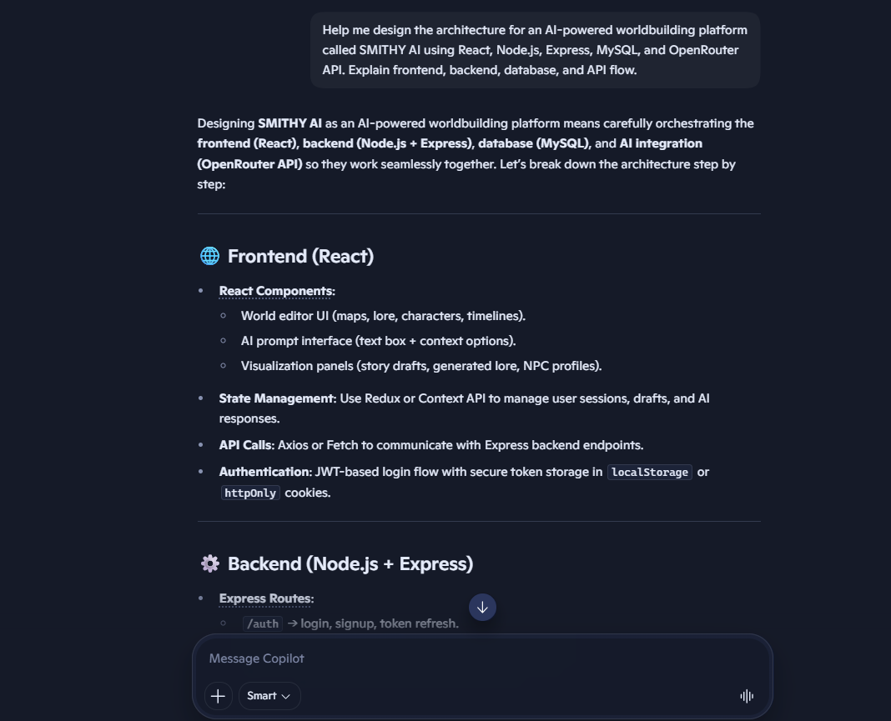
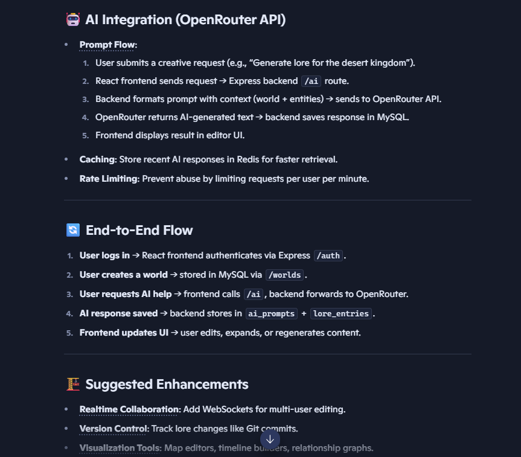
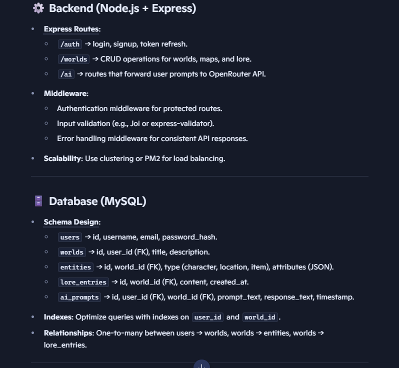
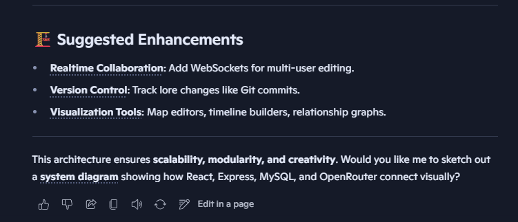

Database Design:

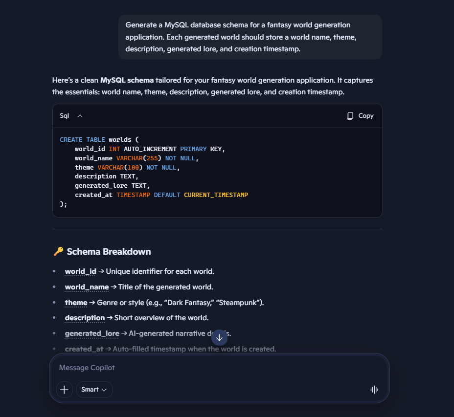
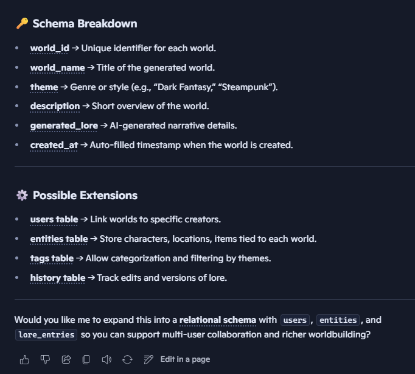

AI Generation Endpoint:

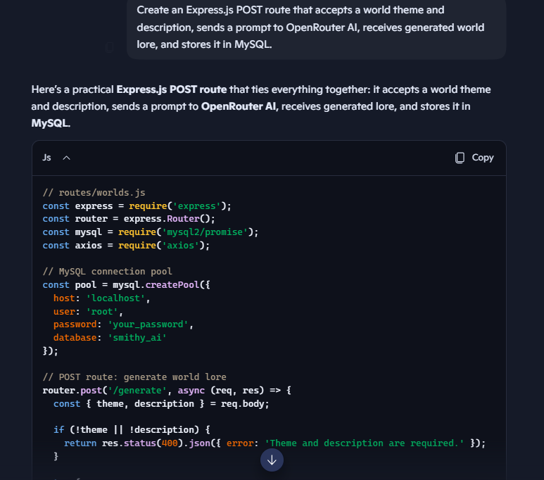
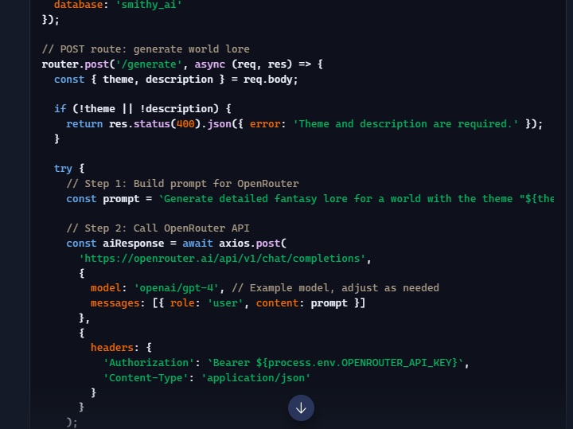
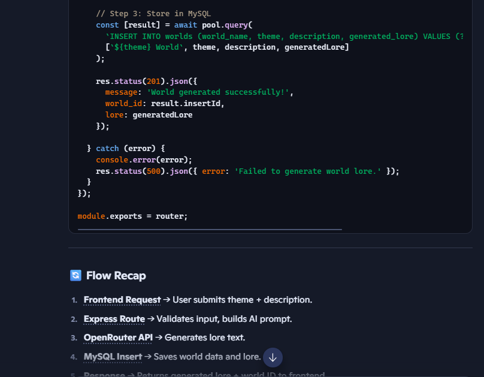
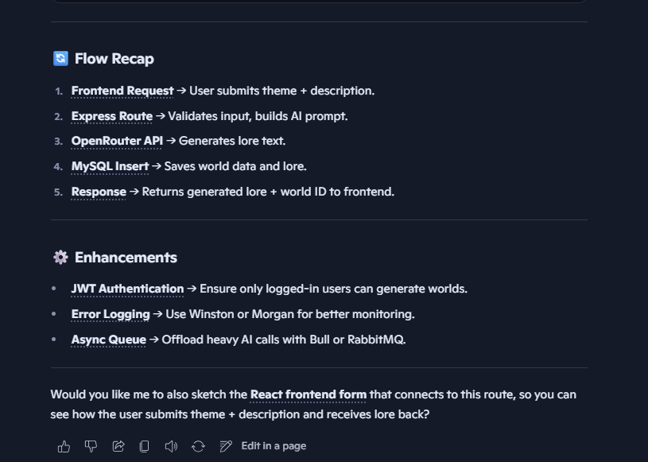

React World Archive:

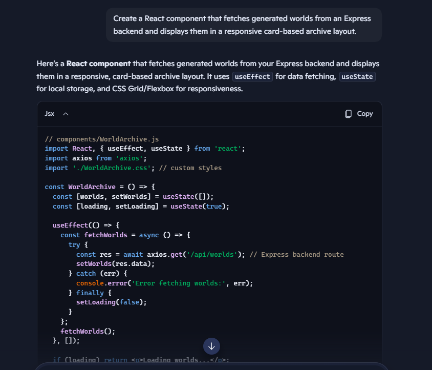
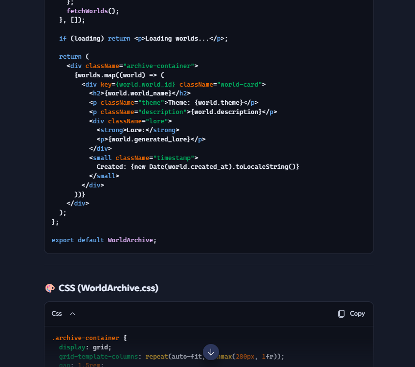
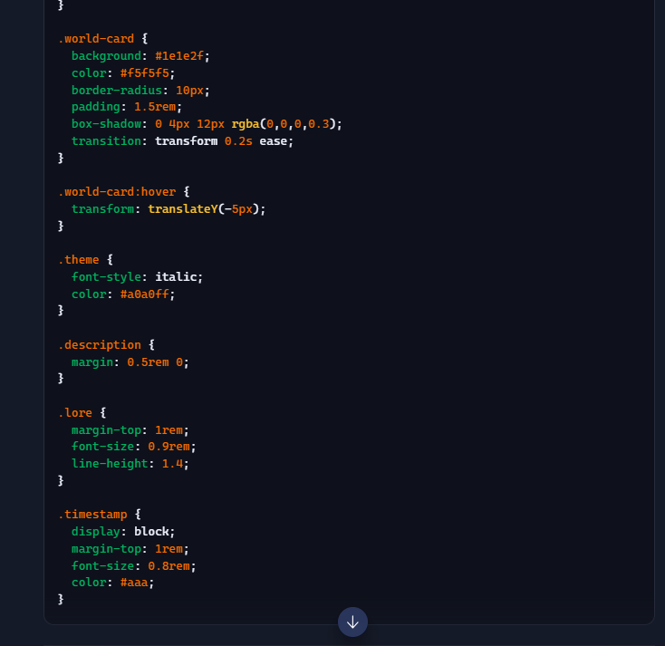
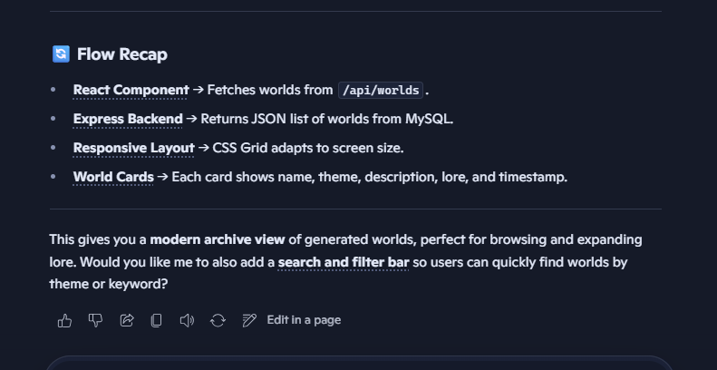

How can GitHub Copilot improve developer productivity while building an AI-powered world generation platform like SMITHY AI?:

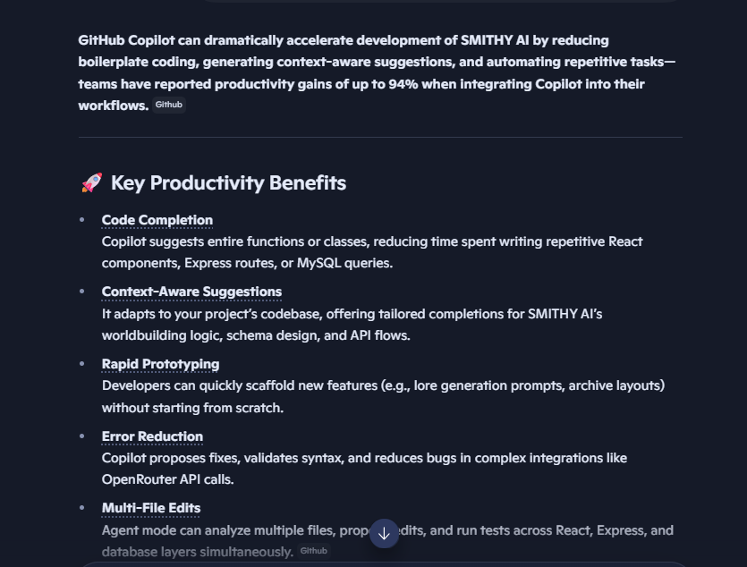
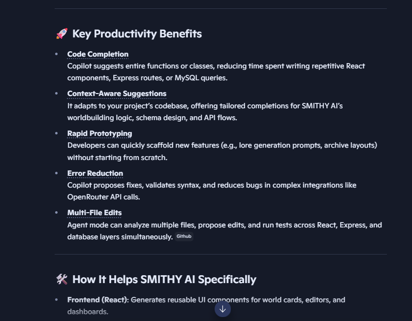
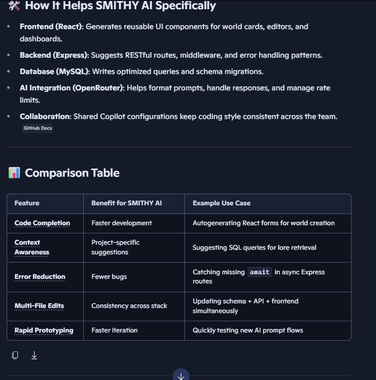
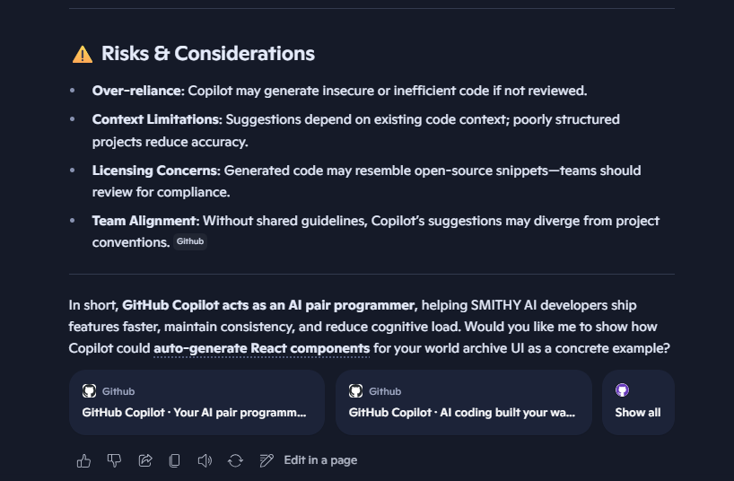